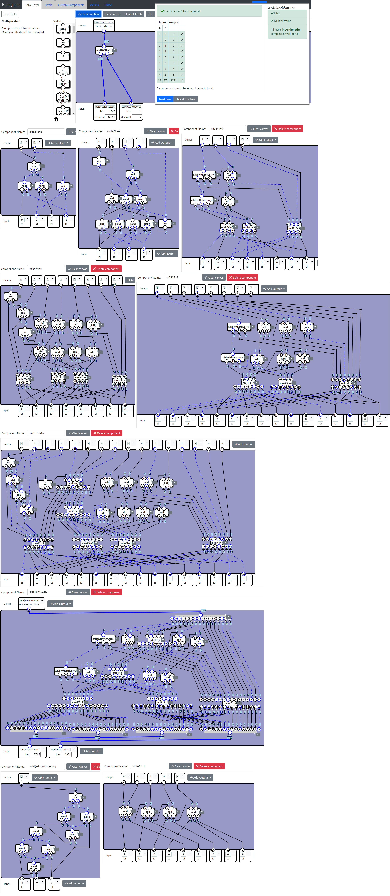

# Nandgame Solution

My solution of [nandgame.com](https://nandgame.com/).

## Table of contents

* [H.4.1 Logic Unit (183 nands)](#h41-logic-unit-183-nands)
* [H.4.2 Arithmetic Unit (232 nands)](#h42-arithmetic-unit-232-nands)
* [H.4.4 Condition (50 nands)](#h44-condition-50-nands)
* [O.3.1 Max (106 nands)](#o31-max-106-nands)
* [O.3.2 Multiplication (1404 nands)](#o32-multiplication-1404-nands)
* [O.4.1 Unary ALU (68 nands)](#o41-unary-alu-68-nands)
* [O.5.2 Floating-point multiplication (205 nands)](#o52-floating-point-multiplication-205-nands)
* [O.5.3 Normalize overflow (118 nands)](#o53-normalize-overflow-118-nands)
* [O.5.6 Add signed magnitude (433 nands)](#o56-add-signed-magnitude-433-nands)

```
******************************************************
*                                                    *
*                                                    *
*                                                    *
*                     Spoiler                        *
*                                                    *
*                     Warning                        *
*                                                    *
*                                                    *
*                                                    *
*                                                    *
*                                                    *
*                                                    *
*                     Spoiler                        *
*                                                    *
*                     Warning                        *
*                                                    *
*                                                    *
*                                                    *
*                                                    *
*                                                    *
*                                                    *
*                     Spoiler                        *
*                                                    *
*                     Warning                        *
*                                                    *
*                                                    *
*                                                    *
*                                                    *
*                                                    *
*                                                    *
*                     Spoiler                        *
*                                                    *
*                     Warning                        *
*                                                    *
*                                                    *
*                                                    *
*                                                    *
*                                                    *
*                                                    *
*                     Spoiler                        *
*                                                    *
*                     Warning                        *
*                                                    *
*                                                    *
*                                                    *
****************************************************** 
```

## H.4.1 Logic Unit (183 nands)

LUT (Lookup Table) is a commenly used trick in FPGAs.


## H.4.2 Arithmetic Unit (232 nands)

Implement add and sub in a single block. Select carry/borrow according to the add/sub bit.


## H.4.4 Condition (50 nands)

Splitting into data[15] and data[14:0] simplifies the logic.


## O.3.1 Max (106 nands)

Let high.lte and high.gte denote that a <= b and a >= b in the higher bits.
* Select a if gte && !lte;
* Select b if !gte && lte;
* Compare a and b if lte && gte.


## O.3.2 Multiplication (1404 nands)

This work implements a 16bits x 16bits = 16bits Vedic Multiplier. (I think someone else's answers were 8bits x 8bits = 16bits.)

Since the overflow bit should be discarded according to the question, two types of components are designed. "mul4\*4=4" omits the 4 overflow bits (and you may find this type of components are quite easy to understand). "mul4\*4=8" keeps the 4 carry bits.

* mul2\*2=2: 8 nands
* mul2\*2=4: 13 nands
* mul4\*4=4: "mul2\*2=4" * 1 + "mul2\*2=2" * 2 + fullAddWithoutCarry * 2 + halfAdd * 2 = 55 nands
* mul4\*4=8: "mul2\*2=4" * 4 + fullAdd * 6 + halfAdd * 3 + 7 = 128 nands
* mul8\*8=8: "mul4\*4=8" * 1 + "mul4\*4=4" * 2 + fullAddWithoutCarry * 2 + fullAdd * 4 + halfAdd * 2 = 300 nands
* mul8\*8=16: "mul4\*4=8" * 4 + add4 * 2 + fullAdd * 6 + halfAdd * 5 + 7 = 670 nands
* mul16\*16=16: "mul8\*8=16" * 1 + "mul8\*8=8" * 2 + fullAddWithoutCarry * 2 + add4 * 2 + fullAdd * 4 + halfAdd * 2 = 1404 nands



> Reference:
> 
> Bathija, Rajesh et al. “Low Power High Speed 16x16 bit Multiplier using Vedic Mathematics.” International Journal of Computer Applications 59 (2012): 41-44.

## O.4.1 Unary ALU (68 nands)

Pre-calculate the common parts.


## O.5.2 Floating-point multiplication (205 nands)

The exponents only have 5 bits, so (X + Y) only requires 5 adders. (X + Y - 15) = (X + Y + 0b10001), so the 2nd layer requires even less adders.

The final nands showed by the game make no sense because the 11 x 11 = 22bits multiplcation is complicated. Anyway...


## O.5.3 Normalize overflow (118 nands)

The exponents only have 5 bits.


## O.5.6 Add signed magnitude (433 nands)

We do not need a "sub16" because:
* a - b = ~(~a + b)
* -a + b = ~(a + ~b)

Similar to my "O.3.1 Max", I build a "unsignedGte16" to detect if a >= b.

The selectors are also optimised in "o56AddSignedTruthTable", in which "s" means the final sign; "a/!a" means invert a if this bit = 0; "!ab/ab" means invert a+b if this bit = 1.

Conclusion: 433 nands
* add: 139 nands
* select A or ~A: 4 * 16 + 1 = 65 nands
* select B or ~B: 4 * 16 + 1 = 65 nands
* final invert: 4 * 16 = 64 nands
* selectors: 9 nands
* unsignedGte16: 91 nands


