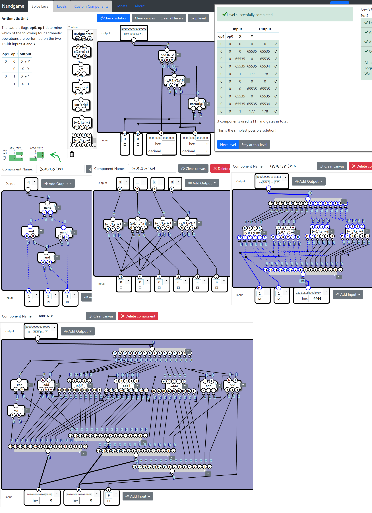

# Nandgame Solution

My solution of [nandgame.com](https://nandgame.com/).

## Table of contents

* [H.4.1 Logic Unit (183 nands)](#h41-logic-unit-183-nands)
* [H.4.2 Arithmetic Unit (232 nands)](#h42-arithmetic-unit-232-nands)
* [H.4.4 Condition (50 nands)](#h44-condition-50-nands)
* [O.3.1 Max (106 nands)](#o31-max-106-nands)
* [O.5.6 Add signed magnitude (434 nands)](#o56-add-signed-magnitude-434-nands)

```
******************************************************
*                                                    *
*                                                    *
*                                                    *
*                     Spoiler                        *
*                                                    *
*                     Warning                        *
*                                                    *
*                                                    *
*                                                    *
****************************************************** 
```

## H.4.1 Logic Unit (183 nands)

LUT (Lookup Table) is a commenly used trick in FPGAs.


## H.4.2 Arithmetic Unit (232 nands)

Implement add and sub in a single block. Select carry/borrow according to the add/sub bit.



## H.4.4 Condition (50 nands)

Splitting into data[15] and data[14:0] simplifies the logic.


## O.3.1 Max (106 nands)

Let high.lte and high.gte denote that a <= b and a >= b in the higher bits.
* Select a if gte && !lte;
* Select b if !gte && lte;
* Compare a and b if lte && gte.


## O.5.6 Add signed magnitude (434 nands)

We do not need a "sub16" because:
* a - b = ~(~a + b)
* -a + b = ~(a + ~b)

Similar to my "O.3.1 Max", I build a "unsignedGte16" to detect if a >= b.

The selectors are also optimised in "o56AddSignedTruthTable", in which "s" means the final sign; "a/!a" means invert a if this bit = 0; "!ab/ab" means invert a+b if this bit = 1.

Conclusion: 343 nands
* add: 139 nands
* select A or ~A: 4 * 16 + 1 = 65 nands
* select B or ~B: 4 * 16 + 1 = 65 nands
* final invert: 4 * 16 = 64 nands
* selectors: 10 nands


